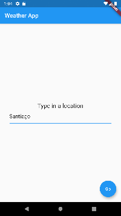
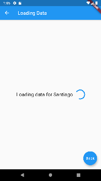
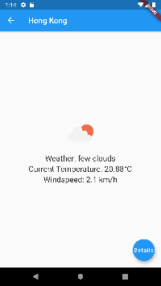
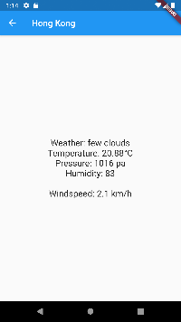

# weather_app
A Flupper app that shows the current weather, temperature and windspeed of a chosen location.

## Motivation
As I wanted to get into Flutter, I started developing this app.

## Screenshots

## Libraries used
[http](https://pub.dev/packages/http) for API calls

## API
I used [OpenWeatherMap](https://openweathermap.org/) to get the weather data.

## What I learned
* I got basic knowledge of Flutter
* I learned hot to make HTTP requests in dart
* I learned about routing

## Author
Andreas Pribitzer
